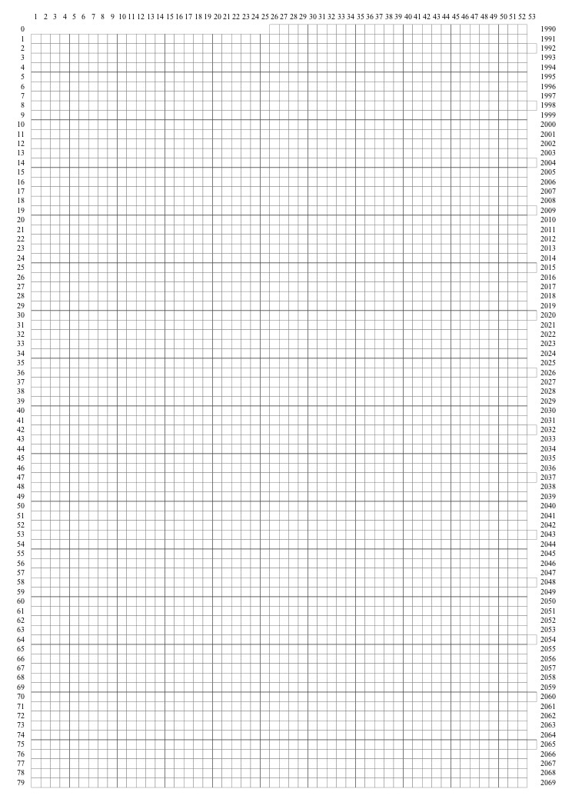

# Plot My Life

Plot My Life is a python script that generates an SVG file which visualizes your life time. An example with weeks, based on ''[Your Life in Weeks](http://waitbutwhy.com/2014/05/life-weeks.html)'':

## Usage

    $ echo 'birthday: 1990-07-01' | python3 generate.py presets/weeks.yml > my-life.svg

Because it writes the SVG to STDOUT, you can also chain it to other programs, for example to [rsvg](http://librsvg.sourceforge.net/docs/man-rsvg.php):

    $ echo 'birthday: 1990-07-01' | python3 generate.py presets/weeks.yml | rsvg-convert -f pdf > my-life.pdf

You can override the settings with adding more YAML files as arguments. In this case, the birtday setting is put into `override.yml`:

    $ python3 generate.py presets/weeks.yml override.yml > my-life.svg
